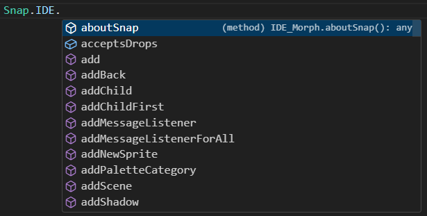

# Snap Extension Framework (SEF)

This is a library to aid in the development of extensions to the [Snap!](https://github.com/jmoenig/Snap) block-based programming environment. It is designed for extensions that require functionality beyond Snap's existing [libraries API](https://github.com/jmoenig/Snap/blob/master/docs/API.md).

## Features

It offers the following features:

### Typescript and CommonJS support

SEF offers modern web development with Typescript and commonjs modules, including inferred types for the original Snap source code. [Snap.d.ts](src/snap/Snap.d.ts).

Using a modern development environment, get code suggestions with typing:



Catch type errors at compile-time:

```typescript
let x = 5;
// Throws a syntax error because IDE.add() only accepts Morph arguments.
Snap.IDE.add(5);
```

### Out-of-the-box event listeners

Easily listen for common events that occur in Snap, with typed arguments describing what happened. See the [EventManager](src/events/EventManager.ts) and [SnapEvents](src/events/SnapEvents.ts) classes.

```typescript
export class MyExtension extends Extension {
    init() {
        console.log("Extension started!");

        // Adds a listener to all events
        this.events.Trace.addGlobalListener((message: string, data: any) => {
            console.log(message, data);
        });

        // Adds a listener to Block.ClickRun event, which receives typed event arguments
        this.events.addListener(new Events.Block.ClickRunListener((args: BlockIDArgs) => {
            console.log("When a block is clicked, this event is run with typed args: ", args.spec);
        }));
    }
}
```

### Easy patching of existing Snap methods

Safely override functions in the original Snap classes to change their behavior globally.

```typescript
// Convenience class to easily add extensions to SpriteMorph
let spriteMorphExtensions = extend(SpriteMorph.prototype);

// Add a function that overrides (replaces) SpriteMorph.add
spriteMorphExtensions.addChild.override(function(context, child) {
    // The overriding function gets the child argument as usual
    // And this refers to the original SpriteMorph receiving the call
    console.log(`Child being added to ${this.name}`, child);

    if (child instanceof BlockMorph) {
        // It also receives a "context" argument that makes it easy to
        // call the original function with the same arguments
        context.callWithOriginalArgs();
    } else {
        // Or with new arguments
        context.callWithNewArgs(...);
    }
});

// We can also add functions that run before or after the original function
spriteMorphExtensions.forward.before(function(context, steps) {
    console.log(`${this.name} moving forward ${steps} steps`);
    // steps is typed as a number
    let x = steps + 1;

    // No need to call the original function, since before does not override
});
```

Or override methods for just a single instance of a class:

```typescript
// Create a single instance of BlockMorph
let blockMorph = new BlockMorph();
// Override the 'add' function just for this instance
OverrideRegistry.extendObject(blockMorph, BlockMorph.prototype.add, function(morph) {
    console.log('BlockMorph.add', morph);
});
```

### Easily create new blocks

The [BlockFactory](src/blocks/BlockFactory.ts) class allows easy creation of new Snap blocks with corresponding actions.

```typescript
export class MyExtension extends Extension {
    init() {
        const blockFactory = this.blocks;
        // Create a new block category called Game with a unique color
        blockFactory.addCategory('Game', new Color(60, 60, 60));

        // Add a new command block called "say hello __" with one input
        blockFactory.registerBlock(new Block(
            'helloWorld', 'say hello %s', [], BlockType.Command, 'Game', false
        // Add a corresponding Sprite action when the block is run
        ).addSpriteAction(function(world: string) {
            // this is the SpriteMorph and world is the input to the block
            this.bubble(`Hello, ${world}!`);
        }));
    }
```


## Setup

SEF is designed to be used as a submodule. A good starter example project can be found in the [sef-logging](https://github.com/thomaswp/sef-logging) repository. Follow the instructions there to set up SEF as a submodule.


## Examples

A full extension example can be found at [snap-games](https://github.com/thomaswp/snap-games/tree/master), which adds camera and physics functions to Snap. A demo can be found [here](https://isnap.csc.ncsu.edu/public/snap-games/snap.html#present:Username=thomaswprice&ProjectName=Angry%20Brids%20Demo).